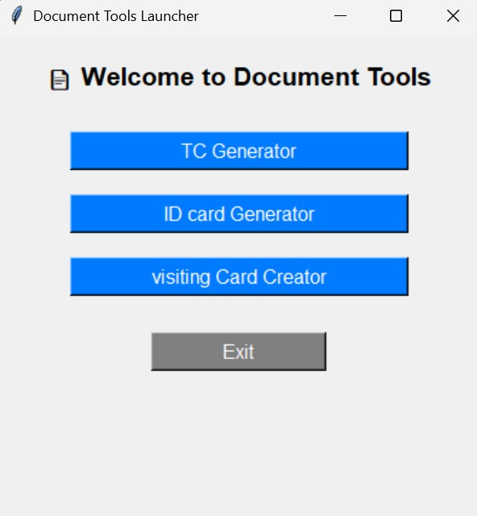

📄 Docs Generator

Docs Generator is a Python-based application with a Tkinter GUI that helps you easily generate:

✅ ID Cards

✅ Transfer Certificates (TC)

✅ Custom Cards & Documents

It uses Jinja2 templates, WeasyPrint, and ReportLab to export professional-quality PDFs.

🚀 Features

🖼️ GUI interface built with Tkinter (easy to use)

🪪 ID Card Generator (PDF export)

📜 Transfer Certificate Generator (custom fields & date picker)

🎨 Card Maker (custom design using Jinja2 templates)

📂 Automatic PDF saving with proper formatting

## 📸 Screenshots  

🛠️ Installation & Usage

Run the following commands step by step in your terminal (PyCharm / VS Code / Command Prompt):

# Clone this repository
git clone https://github.com/udhav996/DocsGenerator.git  

# Move into the project folder
cd DocsGenerator  

# Install dependencies
pip install -r requirements.txt  

# Run the program (main entry point)
python home_gui.py  

📦 Requirements

This project uses the following external libraries:

jinja2

weasyprint

reportlab

tkcalendar

(Already included in requirements.txt)

📂 Project Structure
DocsGenerator/
│── home_gui.py          # Main GUI entry point
│── id_card_generator.py # ID Card generator module
│── card_maker.py        # Custom card generator module
│── TC_gui.py            # GUI for Transfer Certificate
│── TC_generator.py      # Transfer Certificate PDF generator
│── templates/           # Jinja2 templates (HTML for cards/ID)
│── requirements.txt     # Dependencies
│── README.md            # Project documentation

✅ How It Works

Run home_gui.py to open the main window.

Choose what you want to generate:

ID Card

Transfer Certificate (TC)

Custom Card

Fill in the details in the form.

Export your document as a PDF instantly.
